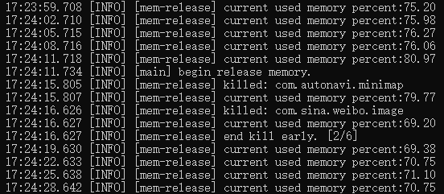

它是一个针对Android手机的内存/进程清理程序。
==================================================
## 一、项目简介
安卓app占用的系统运行内存过大，用户使用过程中，如果一直打开app，运行内存很快会被占满，系统会非常卡顿。卡顿的根源在于没有及时回收内存以运行新的app。有些系统的内存清理策略并不一定符合自己的需求，所以想自己实现内存清理服务。因无法获取root权限，所以通过开发者模式下的adb shell命令，来进行内存清理。用户需要开启开发者模式，并通过adb shell来运行该程序。清理进程的核心命令是：am force-stop。
## 二、使用示例
### 1、开启手机的开发者模式，将usb线连接手机及电脑，确保adb shell能正常连接手机
### 2、使用方法（2种方式）
#### （1）方式1：直接使用编译好的程序（mobile-memory-clean，ARM aarch64）
a、运行cmd窗口，进入build/目录，然后运行如下命令上传程序包：
```
    adb shell mkdir -p /data/local/tmp/mobile-memory/logs
    adb shell mkdir -p /data/local/tmp/mobile-memory/goroot/lib/time/
    adb push mobile-memory-clean /data/local/tmp/mobile-memory/
    adb push start.sh /data/local/tmp/mobile-memory/
    adb push stop.sh /data/local/tmp/mobile-memory/
    adb push zoneinfo.zip /data/local/tmp/mobile-memory/goroot/lib/time/
```
b、在cmd窗口，启动程序：  
注意：start.sh脚本中有参数设置，用户可根据实际情况修改。
```
    adb shell
    cd /data/local/tmp/mobile-memory/
    source start.sh
```
#### （2）方式2：针对开发者，编译源码，生成程序包并使用
a、在windows系统下安装golang开发环境；  
b、配置交叉编译环境（有点复杂，自行百度）；  
c、进入build/目录，通过文本编辑器，打开build64.bat，根据具体情况，修改如下参数：
```
    set CC=D:\adb\gcc-linaro_aarch64-linux-gnu\gcc\bin\aarch64-linux-gnu-gcc
    set CXX=D:\adb\gcc-linaro_aarch64-linux-gnu\gcc\bin\aarch64-linux-gnu-g++
```
d、直接双击build64.bat，编译并上传程序包；  
e、在cmd窗口，启动程序：  
注意：start.sh脚本中有参数设置，用户可根据实际情况修改（白名单）。
```
    cd /data/local/tmp/mobile-memory/
    source start.sh
```
### 3、每次重启手机后，需要重新启动该程序
a、打开cmd窗口，逐行运行如下命令：  
```
    adb shell
    cd /data/local/tmp/mobile-memory/
    source start.sh
```
### 4、停止该程序
a、打开cmd窗口，逐行运行如下命令：  
```
    adb shell
    cd /data/local/tmp/mobile-memory/
    sh stop.sh
```
## 三、内存清理策略
1、每隔一定时间，监控一次内存使用率。  
2、当内存使用率达到设定的阈值时，开始内存清理。  
3、内存清理策略：  
（1）白名单内的不清理  
（2）获取所有普通用户进程，按最近使用情况排序，优先清理最近未使用的进程，一直清理到满足特定条件为止。既预留一定可用内存使手机能够流畅地打开新的app，又尽最大努力保活已运行app。
## 四、实测效果
### 1、手机硬件及环境配置
【魅族note6，flyme6】 CPU：骁龙625；运行内存：3GB；存储：32GB；  
在“系统管家”中，允许所有第三方app后台运行。
### 2、效果
持续打开多个app，系统能预留足够的内存运行新的app，能及时清理最近未使用的app，能保活最近使用的2~3个app，效果很棒。只是手机硬件配置较低，打开app会慢些。  

## 五、提示
可以跟自带的“系统管家”结合使用：在“系统管家”中设置app为“允许后台运行”或“智能后台”。  
## 六、期望
更多策略，等你来定制。